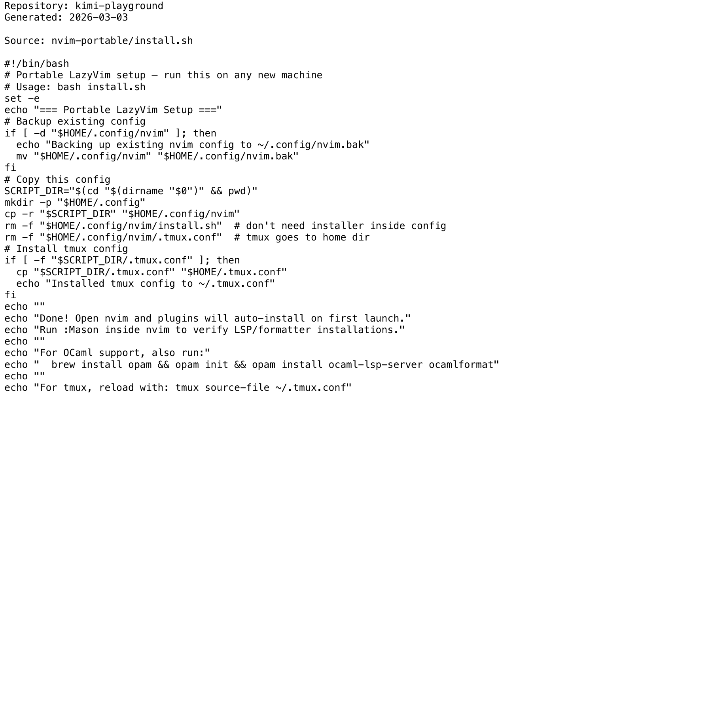

# Project Narrative & Proof

Generated: 2026-03-03

## User Journey
1. Discover the project value in the repository overview and launch instructions.
2. Run or open the build artifact for kimi-playground and interact with the primary experience.
3. Observe output/behavior through the documented flow and visual/code evidence below.
4. Reuse or extend the project by following the repository structure and stack notes.

## Design Methodology
- Iterative implementation with working increments preserved in Git history.
- Show-don't-tell documentation style: direct assets and source excerpts instead of abstract claims.
- Traceability from concept to implementation through concrete files and modules.

## Progress
- Latest commit: 5320739 (2026-03-02) - docs: add professional README with badges
- Total commits: 5
- Current status: repository has baseline narrative + proof documentation and CI doc validation.

## Tech Stack
- Detected stack: GitHub Actions, TypeScript, JavaScript, HTML/CSS

## Main Key Concepts
- Key module area: `nvim-portable`
- Key module area: `wireframe-site`

## What I'm Bringing to the Table
- End-to-end ownership: from concept framing to implementation and quality gates.
- Engineering rigor: repeatable workflows, versioned progress, and implementation-first evidence.
- Product clarity: user-centered framing with explicit journey and value articulation.

## Show Don't Tell: Screenshots


## Show Don't Tell: Code Excerpt
Source: `nvim-portable/install.sh`

```bash
#!/bin/bash
# Portable LazyVim setup — run this on any new machine
# Usage: bash install.sh
set -e
echo "=== Portable LazyVim Setup ==="
# Backup existing config
if [ -d "$HOME/.config/nvim" ]; then
  echo "Backing up existing nvim config to ~/.config/nvim.bak"
  mv "$HOME/.config/nvim" "$HOME/.config/nvim.bak"
fi
# Copy this config
SCRIPT_DIR="$(cd "$(dirname "$0")" && pwd)"
mkdir -p "$HOME/.config"
cp -r "$SCRIPT_DIR" "$HOME/.config/nvim"
rm -f "$HOME/.config/nvim/install.sh"  # don't need installer inside config
rm -f "$HOME/.config/nvim/.tmux.conf"  # tmux goes to home dir
# Install tmux config
if [ -f "$SCRIPT_DIR/.tmux.conf" ]; then
  cp "$SCRIPT_DIR/.tmux.conf" "$HOME/.tmux.conf"
  echo "Installed tmux config to ~/.tmux.conf"
fi
echo ""
echo "Done! Open nvim and plugins will auto-install on first launch."
echo "Run :Mason inside nvim to verify LSP/formatter installations."
echo ""
echo "For OCaml support, also run:"
echo "  brew install opam && opam init && opam install ocaml-lsp-server ocamlformat"
echo ""
echo "For tmux, reload with: tmux source-file ~/.tmux.conf"
```
